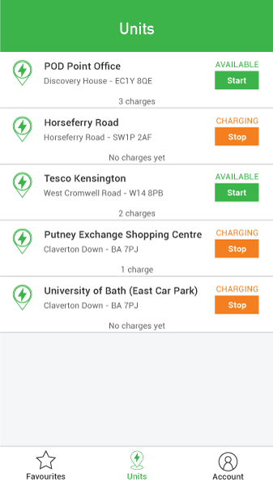

<p align="center">
    
</p>

# Front end Part

***

**Table of Contents**

* [Front end dev environment](#frontend-dev-environment)
    * [Accessing the API](#frontend-dev-environment--accessing-api)
* [The task](#the-task)
    * [To do](#the-task--to-do)
    * [Bonus](#the-task--bonus) (optional)

***

<a id="frontend-dev-environment"></a>
## Front end dev environment

The front end container reads from the `front/public` folder.

This is the section starting the front end container in `bin/docker-run.sh` script:

```bash
docker run -d --name podpoint-front \
    -p 8080:80 \
    -w /var/www/html/ \
    -v ${FRONT_BOOTSTRAP_SCRIPT_PATH}:/bin/dev-start-front.sh \
    -v ${PROJECT_DIR}/front/public:/var/www/html/ \
    -it fauria/lamp bash /bin/dev-start-front.sh
```

The container will initialise by running the following commands:
```bash
npm install
npm run start
```

<a id="frontend-dev-environment--accessing-api"></a>
### Accessing the API

By default, the front end container won't be able to call the API container due to CORS issues.

You bypass this by using the following browser extensions:
  * chrome extension: [https://chrome.google.com/webstore/detail/allow-control-allow-origi/nlfbmbojpeacfghkpbjhddihlkkiljbi](https://chrome.google.com/webstore/detail/allow-control-allow-origi/nlfbmbojpeacfghkpbjhddihlkkiljbi)
  * firefox extension: [https://addons.mozilla.org/en-US/firefox/addon/cors-everywhere/](https://addons.mozilla.org/en-US/firefox/addon/cors-everywhere/)

<a id="the-task"></a>
## The task

We’re keen to move the entire functionality of our Native App into a web application, mirroring the design layout, colour guide and iconography.

For this test you will need to implement this one page application (screen shown below), which details all the units, their current status, and allows a user to start/stop a charge according to the unit current status.

* Units are listed in no specific order.
* No charge currently running on the Unit -> The unit status is `Available`.
  * A green `Start` button is shown to allow a user to start a charge.
* A charge is currently running on the Unit -> The unit status is `Charging`.
  * An orange `Stop` button is shown to allow a user to stop the charge.
* The total number of charges on this unit is displayed at the bottom of each unit item.  
  

<p align="center">
    <a href="../support/design.png">
        
        <br />
        View High Resolution
    </a>
</p>

<a id="the-task--to-do"></a>
### To do

We’d like you to take this simple screen, and:
* Supply all of your source files.
* Using a mobile first approach, make it responsive.
* Markup the elements into an HTML structure, with associated stylesheet files.
* Make use of SASS/LESS (whichever is your favourite).
* Prepare a `start` npm task in order to compile the CSS & JS inside the `front/public` folder with a task runner (such as Gulp or Webpack).
* You don’t need to worry about any hamburger page menu.
* Do not bother about handling clicks on the other buttons (`Favourites`, or `Account`).

<a id="the-task--bonus"></a>
### Bonus (optional)

* Make it a React JS application.
* Use Redux.
* Add some unit and/or functional tests to your implementation.

***

<p align="center">
    <a href="../README.md">
        Back to README
    </a>
</p>

***
